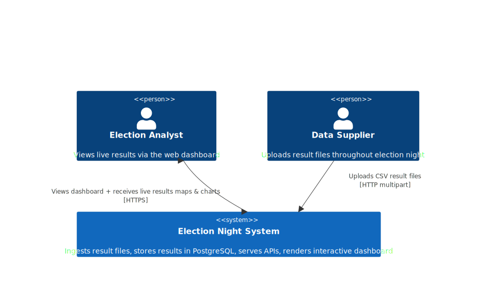

# Election Night Results System

A full-stack application for ingesting, processing, and visualising UK general election results in real time. Built as a data-intensive pipeline that accepts continuously updated result files from a data supplier and presents live constituency-level and national-level insights through an interactive web dashboard.

<!-- Architecture diagram -->
<!-- ```mermaid
C4Context
    Person(user, "Election Analyst", "Views live results via the web dashboard")
    Person(supplier, "Data Supplier", "Uploads result files throughout election night")
    System(system, "Election Night System", "Ingests result files, stores results in PostgreSQL, serves APIs, renders interactive dashboard")

    Rel(supplier, system, "Uploads CSV result files", "HTTP multipart")
    BiRel(user, system, "Views dashboard + receives live results maps & charts", "HTTPS")

    UpdateRelStyle(supplier, system, $offsetX="70",  $offsetY="-20")
    UpdateRelStyle(user,     system, $offsetX="-300", $offsetY="10")
``` -->




## Tech Stack

| Layer | Technology | Version |
|-------|-----------|---------|
| Frontend | Next.js (App Router) | 16 |
| UI Framework | React | 19 |
| Data Fetching | SWR | 2.4 |
| Styling | Tailwind CSS | 4 |
| Charts | Recharts, d3-parliament-chart | — |
| Maps | D3 + TopoJSON | 7.9 |
| Backend | FastAPI | 0.115 |
| ORM | SQLAlchemy | 2.0 |
| Database | PostgreSQL | 16 |
| Migrations | Alembic | 1.13 |
| Containerisation | Docker Compose | — |
| Testing | pytest, Vitest, Playwright | — |

## Quick Start

### Prerequisites

- [Docker](https://docs.docker.com/get-docker/) & Docker Compose
- [Make](https://www.gnu.org/software/make/) (pre-installed on macOS/Linux)
- [Git](https://git-scm.com/)

### Run the System

```bash
# 1. Clone the repository
git clone git@github.com:Franreno/Election-Night.git
cd Election-Night

# 2. Start all services (builds images, runs migrations automatically)
make up

# 3. Seed the database with sample election data
make seed

# 4. Open the dashboard
open http://localhost:3000
```

| Service | Default URL |
|---------|-------------|
| Frontend (Dashboard) | http://localhost:3000 |
| Backend API | http://localhost:8000 |
| Swagger / OpenAPI Docs | http://localhost:8000/docs |
| PostgreSQL | localhost:5432 (user: `postgres`, password: `postgres`, db: `election`) |

> **Port conflict?** If ports 3000, 8000, or 5432 are already in use, see [Changing Ports](#changing-ports) below.

To stop everything:

```bash
make down
```

### Changing Ports

The default ports are **3000** (frontend), **8000** (backend), and **5432** (database). If any of these conflict with services already running on your machine, create a `.env` file in the project root:

```bash
# .env (project root)
FRONTEND_PORT=3100
BACKEND_PORT=8100
DB_PORT=5433
```

Then rebuild and start:

```bash
make rebuild
```

Docker Compose and the Makefile will both pick up these values automatically. The frontend build will be configured to call the backend at the correct port, and the backend CORS will allow the frontend origin.

Alternatively, you can pass them inline without a `.env` file:

```bash
FRONTEND_PORT=3100 BACKEND_PORT=8100 make rebuild
```

## How Result Files Are Uploaded

### File Format

Each line represents one constituency's results as comma-separated values:

```
constituency_name,votes1,party_code1,votes2,party_code2,...
```

Example:

```
Basildon and Billericay,6898,C,11608,L,2008,LD,937,Ind,612,UKIP,1521,G
Sheffield\, Hallam,8228,C,21881,L,5765,LD,543,Ind,823,UKIP,3437,G
```

- The number of parties per constituency varies
- Commas within constituency names are escaped with `\,`
- Valid party codes: `C` (Conservative), `L` (Labour), `LD` (Liberal Democrats), `UKIP`, `G` (Green), `SNP`, `Ind` (Independent)

### Upload via the UI

1. Navigate to **Upload** in the sidebar (`/upload`)
2. Drag and drop a `.txt` file onto the dropzone — or click **Browse files**
3. The system parses, validates, and stores results automatically
4. Upload history and stats are shown below the dropzone

### Upload via the API

```bash
curl -X POST http://localhost:8000/api/upload \
  -F "file=@election-results-sample.txt;type=text/plain"
```

Or use the Makefile shortcut:

```bash
make seed   # uploads the bundled sample file
```

### Update Semantics

Files can be uploaded repeatedly throughout election night. When a new file is processed:

- **New constituencies** are inserted
- **Existing constituencies** have their party results upserted:
  - Parties present in the new file **override** existing vote counts
  - Parties **not** in the new file are left unchanged
- This ensures the system always reflects the latest known correct state

## API Overview

| Method | Endpoint | Description |
|--------|----------|-------------|
| `GET` | `/api/health` | Health check |
| `POST` | `/api/upload` | Upload a result file |
| `GET` | `/api/uploads` | List upload history (paginated, filterable) |
| `GET` | `/api/uploads/stats` | Upload statistics |
| `DELETE` | `/api/uploads/{id}` | Soft-delete an upload |
| `GET` | `/api/constituencies` | List constituencies (search, filter, sort, paginate) |
| `GET` | `/api/constituencies/summary` | Lightweight summary for the map |
| `GET` | `/api/constituencies/{id}` | Single constituency detail |
| `GET` | `/api/totals` | National totals (votes + seats per party) |
| `GET` | `/api/geography/regions` | List all regions |
| `GET` | `/api/geography/regions/{id}` | Region detail with constituencies |

Full documentation: [docs/API_REFERENCE.md](docs/API_REFERENCE.md)

## Project Structure

```
tech_blueoasis/
├── Makefile                          # Dev commands (docker, db, test, e2e)
├── docker-compose.yml                # Dev stack (3 services)
├── docker-compose.e2e.yml            # Isolated E2E test stack
├── election-results-sample.txt       # Sample data (649 constituencies)
├── backend/
│   ├── Dockerfile
│   ├── requirements.txt
│   ├── alembic/                      # Database migrations
│   │   └── versions/
│   │       ├── 001_initial_schema.py
│   │       ├── 002_add_regions_and_geography.py
│   │       └── 003_add_upload_tracking.py
│   ├── app/
│   │   ├── main.py                   # FastAPI application
│   │   ├── config.py                 # Environment config
│   │   ├── constants.py              # Party code mappings
│   │   ├── database.py               # SQLAlchemy setup
│   │   ├── models/                   # ORM models
│   │   ├── routers/                  # API endpoints
│   │   ├── schemas/                  # Pydantic schemas
│   │   └── services/                 # Business logic
│   ├── static/                       # TopoJSON + region config
│   └── tests/                        # pytest suite
└── frontend/
    ├── Dockerfile                    # Multi-stage build
    ├── app/                          # Next.js App Router pages
    │   ├── page.tsx                  # Dashboard
    │   ├── constituencies/           # List + detail pages
    │   └── upload/                   # Upload page
    ├── components/                   # React components
    │   ├── dashboard/                # Hemicycle, charts, stats
    │   ├── map/                      # D3 choropleth map
    │   ├── constituencies/           # Table, search, filters
    │   ├── upload/                   # Dropzone, history, stats
    │   └── ui/                       # Shadcn/UI primitives
    ├── hooks/                        # SWR data-fetching hooks
    ├── lib/                          # API client, types, utilities
    ├── tests/                        # Vitest unit tests
    └── e2e/                          # Playwright E2E tests
```

## Testing

```bash
# Run all unit tests (backend + frontend)
make test

# Backend only (pytest)
make test-backend

# Frontend only (vitest)
make test-frontend

# End-to-end tests (Playwright, isolated Docker stack)
make test-e2e

# Everything
make test-all
```

CI runs automatically on push/PR via GitHub Actions (`.github/workflows/tests.yml` and `.github/workflows/e2e.yml`).

## Design Decisions & Assumptions

### Architecture

- **Service-layer pattern**: Routers delegate to service modules, keeping endpoint handlers thin and business logic testable in isolation
- **Upsert-based ingestion**: Uses PostgreSQL `INSERT ... ON CONFLICT DO UPDATE` on a `(constituency_id, party_code)` unique constraint to guarantee idempotent, order-independent updates
- **Fuzzy constituency matching**: A 3-tier strategy (exact → case-insensitive → normalized) ensures uploaded names reliably map to the canonical 650-constituency dataset, tolerating variations in casing, diacritics (`Ynys Môn`), and comma escaping

### Data Model

- **Pre-seeded constituencies**: All 650 UK parliamentary constituencies are seeded via Alembic migration 002 from ONS data, along with 12 ITL1 regions. Uploads match against this canonical set rather than creating constituencies on the fly
- **Soft-delete uploads**: Upload logs are soft-deleted (`deleted_at` timestamp) rather than hard-deleted, preserving audit history
- **No seat for ties**: If two parties tie on votes in a constituency, no MP seat is awarded — matching real-world returning officer tiebreak rules where this would go to a recount

### Frontend

- **SWR polling** (30s for election data, 10s for uploads) provides near-real-time updates.
- **URL-persisted filters**: Region filter selections are stored in query params (`?regions=1,2,3`) so filtered views are shareable and survive page refreshes
- **D3 for maps, Recharts for charts**: D3 gives fine-grained control over the interactive choropleth; Recharts handles standard bar/pie charts declaratively

### Testing Strategy

- **Backend unit tests** run against in-memory SQLite with `StaticPool` for speed, while the real stack uses PostgreSQL
- **E2E tests** run against an isolated Docker stack on different ports (3001/8001) to avoid interfering with development
- **Dual E2E modes**: Tests run twice: once with a clean database and once seeded. To verify both empty states and data-rich flows

## Further Documentation

| Document | Description |
|----------|-------------|
| [docs/SETUP.md](docs/SETUP.md) | Step-by-step setup guide |
| [docs/DEPLOYMENT.md](docs/DEPLOYMENT.md) | Docker configuration & environment variables |
| [docs/API_REFERENCE.md](docs/API_REFERENCE.md) | Complete API reference |
| [docs/DATABASE.md](docs/DATABASE.md) | Database schema & ERD |
| [docs/ARCHITECTURE.md](docs/ARCHITECTURE.md) | Architecture overview & C4 diagrams |
| [docs/SEQUENCE_DIAGRAMS.md](docs/SEQUENCE_DIAGRAMS.md) | Key flow sequence diagrams |
| [docs/DEVELOPER_GUIDE.md](docs/DEVELOPER_GUIDE.md) | Frontend & backend developer guides |
| [docs/CODE_STANDARDS.md](docs/CODE_STANDARDS.md) | Code standards & conventions |
