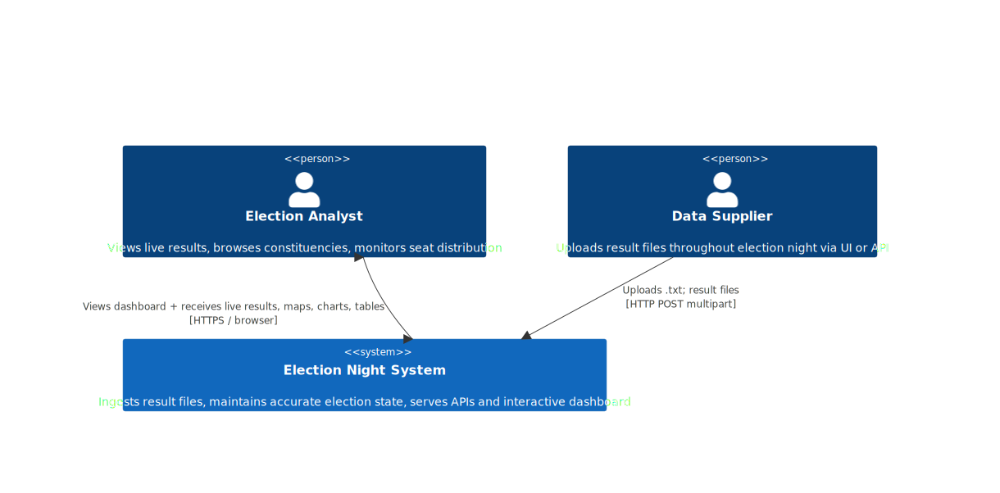
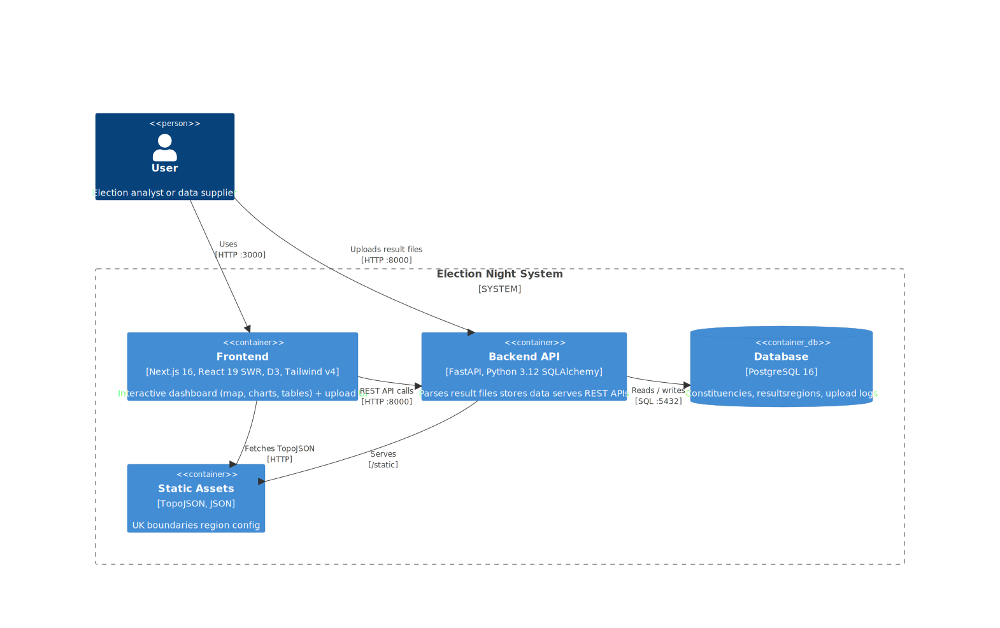

# Architecture Overview

## C4 Context Diagram

The system sits between a data supplier (who uploads result files) and election analysts (who view the dashboard).

<!-- ```mermaid
C4Context
    title Election Night — System Context

    Person(analyst, "Election Analyst", "Views live results, browses constituencies, monitors seat distribution")
    Person(supplier, "Data Supplier", "Uploads result files throughout election night via UI or API")

    System(system, "Election Night System", "Ingests result files, maintains accurate election state, serves APIs and interactive dashboard")

    Rel(supplier, system, "Uploads .txt result files", "HTTP POST multipart")
    Rel(analyst, system, "Views dashboard, drills into constituencies", "HTTPS / browser")
    Rel(system, analyst, "Serves live results, maps, charts, tables")
``` -->



## C4 Container Diagram

Three containerised services communicate over Docker networking.

<!-- ```mermaid
C4Container
    Person(user, "User", "Election analyst or data supplier")

    System_Boundary(system, "Election Night System") {
        Container(frontend, "Frontend", "Next.js 16, React 19 SWR, D3, Tailwind v4", "Interactive dashboard (map, charts, tables) + upload UI")
        Container(backend, "Backend API", "FastAPI, Python 3.12 SQLAlchemy", "Parses result files stores data serves REST APIs")
        ContainerDb(db, "Database", "PostgreSQL 16", "Constituencies, resultsregions, upload logs")
        Container(static, "Static Assets", "TopoJSON, JSON", "UK boundaries region config")
    }

    Rel_R(user, frontend, "Uses", "HTTP :3000")
    Rel_R(user, backend, "Uploads result files", "HTTP :8000")
    Rel_D(frontend, backend, "REST API calls", "HTTP :8000")
    Rel_D(backend, db, "Reads / writes", "SQL :5432")
    Rel_L(backend, static, "Serves", "/static")
    Rel_L(frontend, static, "Fetches TopoJSON", "HTTP")

    UpdateRelStyle(user, frontend, $offsetY="-35")
    UpdateRelStyle(user, backend,  $offsetY="-25")

    UpdateRelStyle(frontend, backend, $offsetX="-45", $offsetY="15")
    UpdateRelStyle(backend, db,       $offsetX="-38", $offsetY="15")

    UpdateRelStyle(backend, static,   $offsetY="20")
    UpdateRelStyle(frontend, static,  $offsetY="25")
``` -->



## Component Diagram — Backend



## Component Diagram — Frontend



## Data Flow Overview

### Read Path (Dashboard, Constituencies)

```
Browser → Next.js page → SWR hook (polling every 30s)
       → apiFetch() → GET /api/... → FastAPI router
       → Service layer → SQLAlchemy query → PostgreSQL
       → JSON response → SWR cache → React re-render
```

### Write Path (Upload)

```
Browser → FileDropzone → useUploadFile hook
       → POST /api/upload (FormData) → FastAPI router
       → Ingestion service → Parser → ConstituencyMatcher
       → Upsert results → PostgreSQL
       → UploadResponse → SWR cache invalidation → all data refreshes
```

### Map Rendering

```
Browser → ConstituencyMap component
       → Fetch TopoJSON from /static/uk-constituencies.topojson
       → Convert to GeoJSON (topojson-client)
       → Fetch constituency summary (SWR)
       → Match features to DB records by name/pcon24_code
       → D3 geoMercator projection → SVG paths
       → Color by winning party → Render with zoom/pan/tooltips
```

## Key Design Patterns

### Service Layer

All business logic lives in `backend/app/services/`. Routers are thin — they handle HTTP concerns (validation, status codes) and delegate to services. This makes business logic independently testable.

### Upsert-Based Ingestion

The `(constituency_id, party_code)` unique constraint on `results` enables PostgreSQL's `INSERT ... ON CONFLICT DO UPDATE` for atomic, idempotent updates. This is the foundation of the update semantics: new data overwrites existing data for the same constituency + party pair, while leaving other parties untouched.

### Fuzzy Constituency Matching

The `ConstituencyMatcher` in `ingestion.py` uses a 3-tier strategy to match uploaded constituency names to the canonical 650-constituency dataset:

1. **Exact match** — Case-sensitive string comparison
2. **Case-insensitive match** — Lowercased comparison
3. **Normalized match** — NFD Unicode normalisation, diacritic removal, comma stripping, and lowercasing (e.g., `"Ynys Mon"` → matches `"Ynys Môn"`, `"BIRMINGHAM HALL GREEN"` → matches `"Birmingham, Hall Green"`)

### SWR Polling for Near-Real-Time Updates

Rather than WebSockets, the frontend uses SWR's `refreshInterval` to poll the backend:
- **30 seconds** for election data (totals, constituencies, map)
- **10 seconds** for upload history

This provides near-real-time updates with minimal complexity. SWR also handles caching, deduplication, and revalidation on window focus.

### URL-Persisted Filters

Region filter selections on the constituencies page are stored in URL query parameters (`?regions=1,2,3`). This means:
- Filtered views are shareable via URL
- Browser back/forward navigation preserves filters
- Page refreshes don't lose filter state

### Soft Delete

Upload logs are never physically deleted. Setting `deleted_at` provides an audit trail while hiding deleted records from the UI and API responses.

## Technology Choices

| Decision | Choice | Rationale |
|----------|--------|-----------|
| Backend framework | FastAPI | Async-capable, automatic OpenAPI docs, Pydantic validation |
| ORM | SQLAlchemy 2.0 | Mature, flexible, supports upsert patterns |
| Database | PostgreSQL 16 | Robust, supports `ON CONFLICT`, JSON columns, mature |
| Frontend framework | Next.js 16 (App Router) | React 19 features, file-based routing, standalone Docker output |
| Data fetching | SWR | Lightweight, built-in polling, cache invalidation, stale-while-revalidate |
| Map rendering | D3 + TopoJSON | Full control over SVG rendering, smooth zoom/pan, small bundle |
| Charts | Recharts | Declarative React charts, good for standard bar/pie/donut |
| Parliament viz | d3-parliament-chart | Purpose-built hemicycle layout |
| Styling | Tailwind CSS v4 | Utility-first, OKLCH theme tokens, dark mode |
| UI primitives | Shadcn/UI (Radix) | Accessible, unstyled headless components |
| Migrations | Alembic | SQLAlchemy-native, versioned, supports data seeding |
| Testing | pytest + Vitest + Playwright | Unit + E2E coverage across both stacks |
| Containerisation | Docker Compose | Single-command dev environment, isolated E2E stack |
