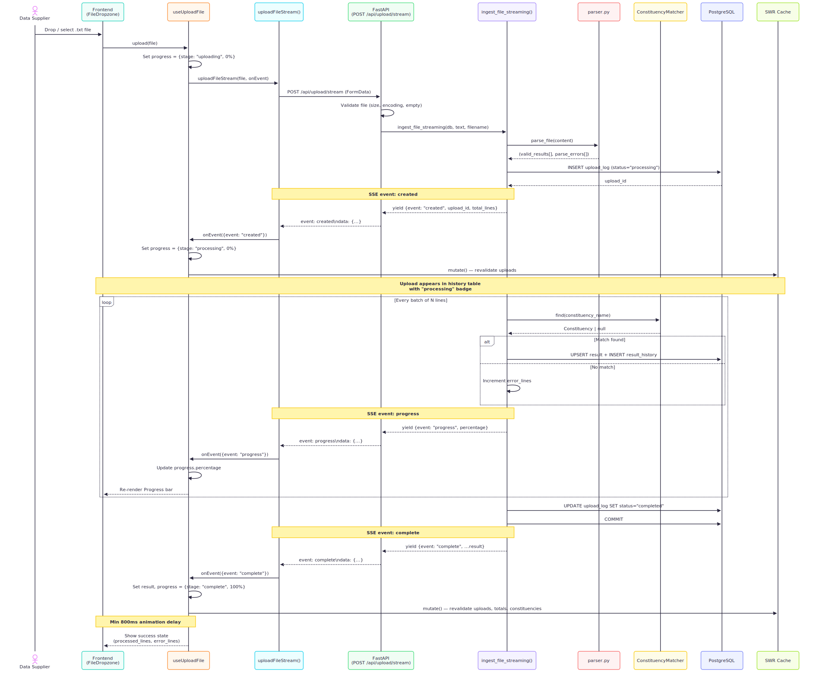
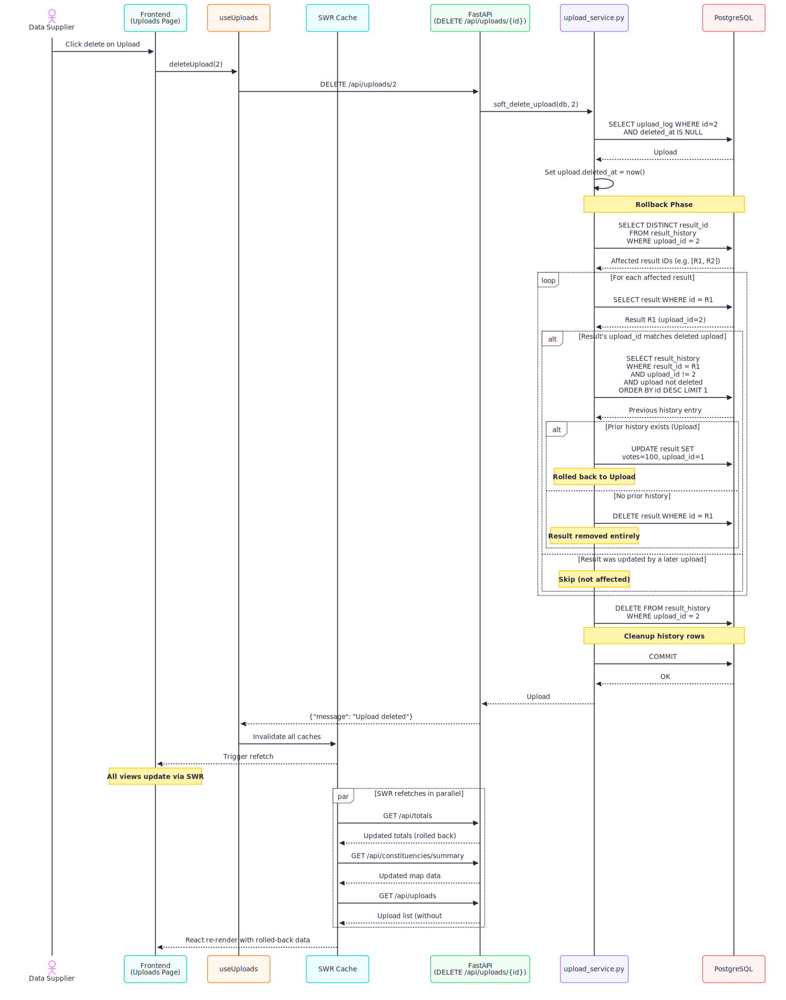

# Sequence Diagrams

Key system flows illustrated as sequence diagrams.

---

## 1. Upload Flow (SSE Streaming)

End-to-end flow when a data supplier uploads a result file. The backend streams progress events via Server-Sent Events (SSE) so the frontend can show a real-time progress bar and immediately add the upload to the history table.

---

## 2. Aggregation / Totals Flow

How the dashboard fetches and displays national-level election results.

---

## 3. Map Rendering Flow

How the interactive choropleth map loads data and renders UK constituency boundaries.

---

## 4. Constituency Detail Flow

How a user drills into a single constituency from the table or map.

---

## 5. Upload Delete with Rollback Flow

How deleting an upload rolls back affected results to their previous values using the result history table.

