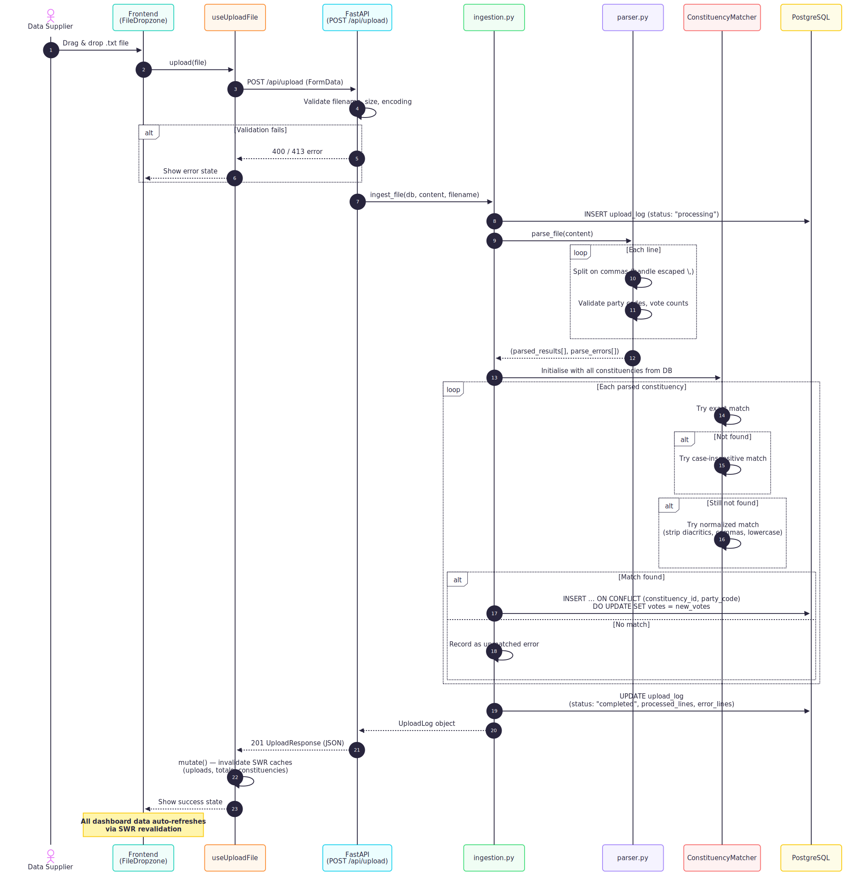
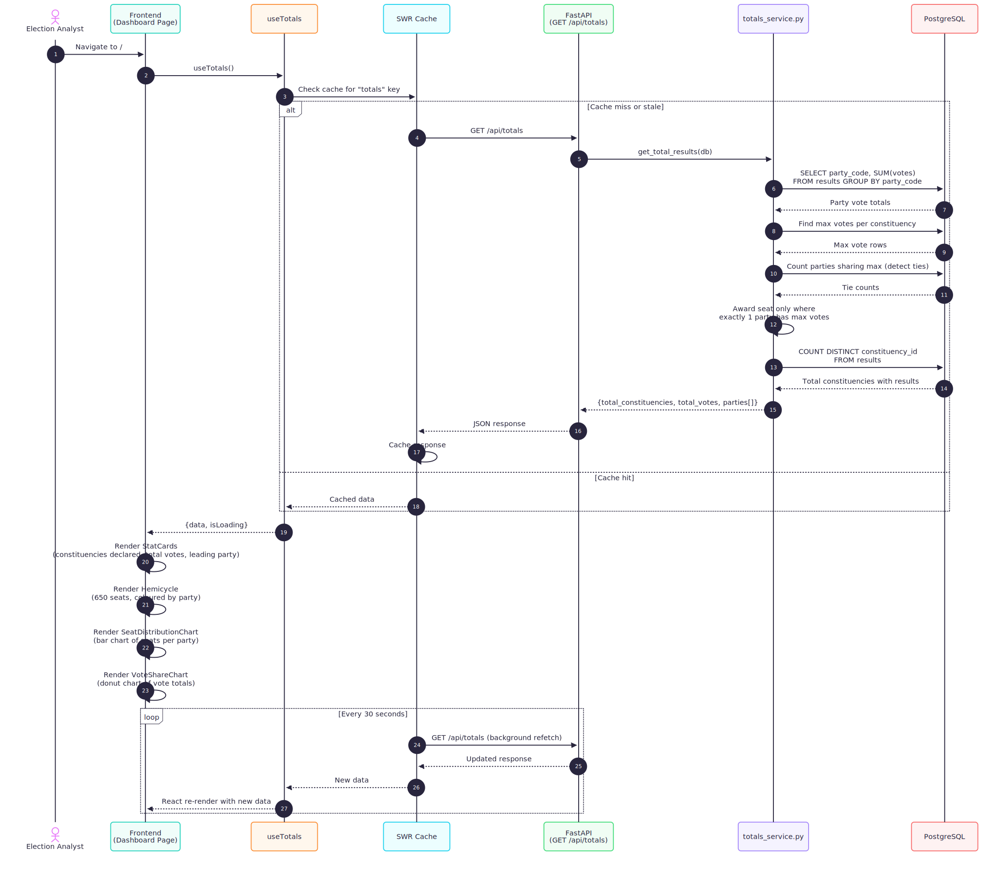
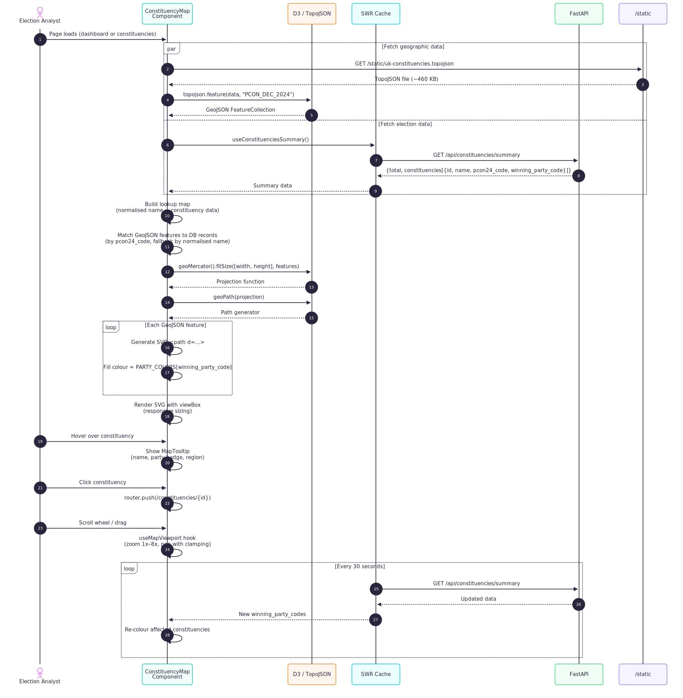
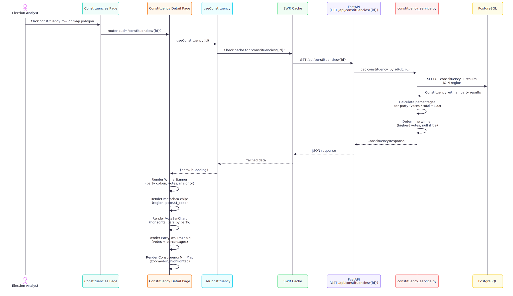

# Sequence Diagrams

Key system flows illustrated as sequence diagrams.

---

## 1. Upload Flow

End-to-end flow when a data supplier uploads a result file.

---

## 2. Aggregation / Totals Flow

How the dashboard fetches and displays national-level election results.

---

## 3. Map Rendering Flow

How the interactive choropleth map loads data and renders UK constituency boundaries.

---

## 4. Constituency Detail Flow

How a user drills into a single constituency from the table or map.

